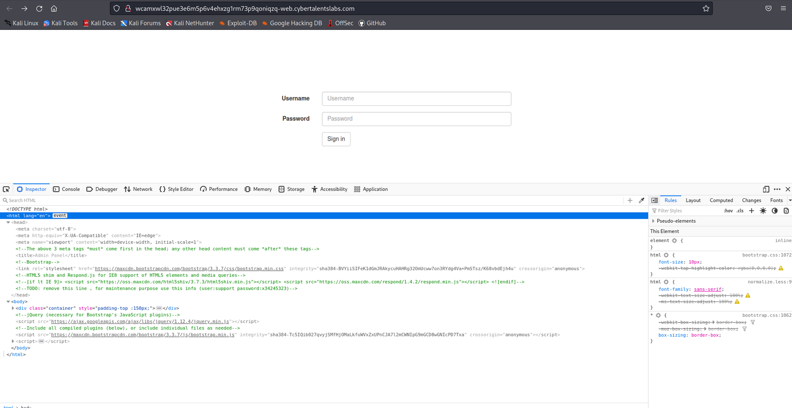
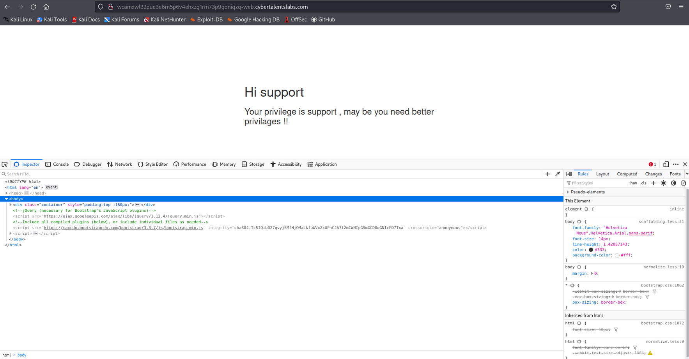
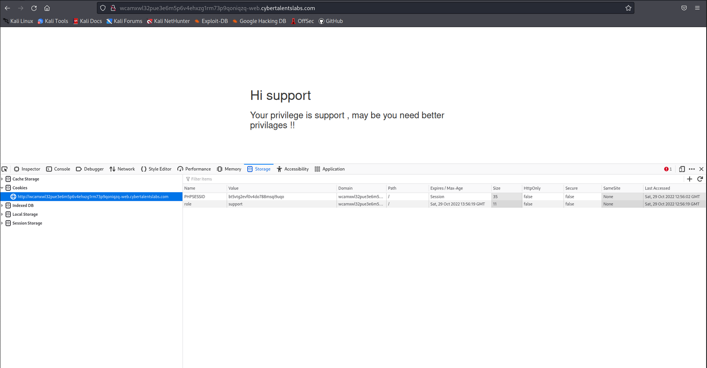
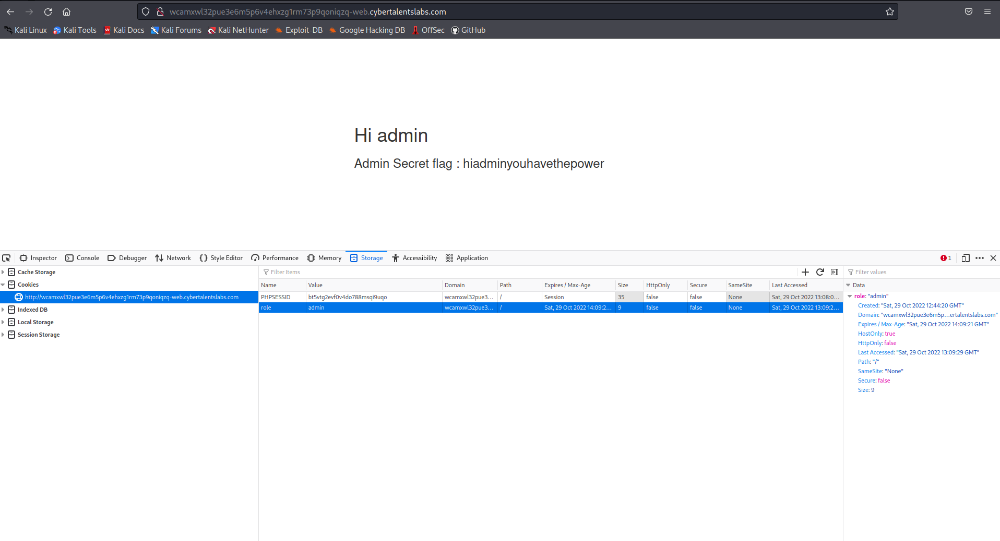

# Admin has the power

The goal of this task is edit a session cookie.

From [CyberTalents](https://cybertalents.com/learn/introduction-to-cybersecurity/lessons/5-cookies):

>When a browser requests a web page from a server, cookies belonging to the page are added to the request. This way the server gets the necessary data to "remember" information about users.

Except in this challenge we manipulate the session cookie of the "support" user to bypass authenticating as an administrative user.

Spinning up the ctf link, I'm greeted with a basic sign in page:



I inspect the page and locate an interesting comment in the head of the HTML:

```
TODO: remove this line ,  for maintenance purpose use this info (user:support password:x34245323)
```
 
I try these credentials before doing anything else and I reach this screen:


 
Because I have logged in there should be a session cookie, I check and see the following:


 
The two cookies are "PHPSESSID" and "role". Thinking about the name of the challenge, I test out changing the cookie name to "admin" by manually editing the cookie and resubmitting to the server. I refresh and see this page:



The webserver accepted the cookie change and granted admin access to the website, which revealed the flag "hiadminyouhavethepower".
