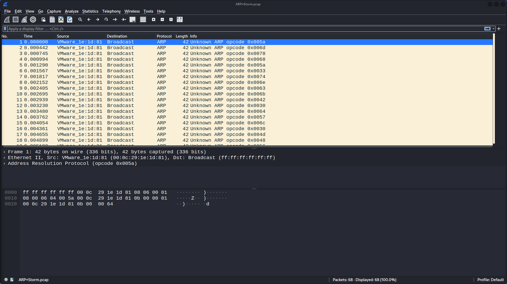

# ARP Storm

__(Easy, Network Security, 50 Points)__

[Challenge Link](https://cybertalents.com/challenges/network/arp-storm)

>An attacker in the network is trying to poison the arp table of 11.0.0.100, the admin captured this PCAP.

We're given a pcap file, which I open in Wireshark and right away notice that every packet in the file is an ARP broadcast request, and that they are coming from the same VMware source. I also notice that every single frame is the same length, 42 bytes.

This would be very unusual in the real world, but for the sake of the CTF, I’m not seeing any difference in the packets and it’s not exactly clear what I’m looking for. I double click the first packet to inspect the packet details and the various network layer information. Nothing stands out.

I do find it odd that the opcodes for each packet are “Unknown.” Address Resolution Protocol frames are only one of two types, a request or a reply. For an ARP request, the opcode is 1, for a reply, the opcode is 2. The fact that each packet here has an "Unknown" opcode is strange:

And this is where I start to see a difference in the packets. In Wireshark, clicking on any of the fields in the packet details pane will highlight by default the associated hexadecimal values in the hexdump beneath that (i.e., the packet bytes pane).

Highlighting “Opcode” and toggling between different packets; the associated hex pairs are indeed different frame-to-frame:

The associated ASCII characters being hightlighted change as well, as expected. I use my arrow keys to go through all 68 packets starting from the top, just to confirm that the hex/ASCII are in fact changing in each frame.

Each ASCII character is either a number or upper/lowercase letter. The character in the final frame is a “=” and I almost immediately know that these characters are the flag, in base64 format. I just have to write them down or use another method to parse them out of the packets.

After thinking about how to do this, I decide against doing it manually and that I’ll use tcpdump to move the pcap content into a .txt file where it will easier to delete unneeded characters. I open up the file in Visual Studio Code and use regex find and replace to begin to remove unneeded content:

I eventually arrive at the full string: 

`ZmxhZ3tnckB0dWl0MHVzXzBwY09kZV8xc19BbHdAeXNfQTZ1U2VkX3QwX3AwMXMwbn0=`

Returning to my terminal I echo the string to base64 and get the flag:

`flag{gr@tuit0us_0pcOde_1s_Alw@ys_A6uSed_t0_p01s0n}`
