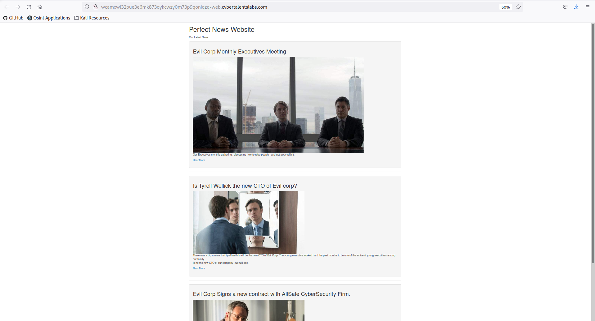
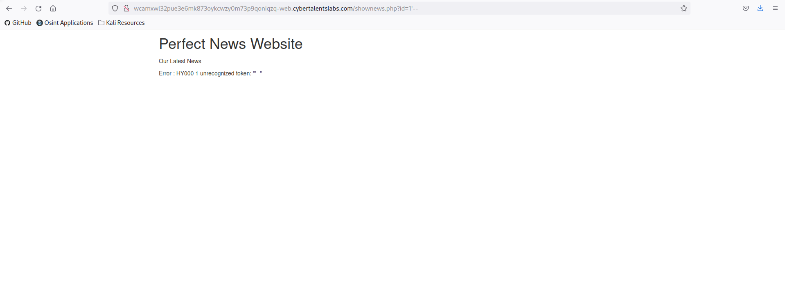
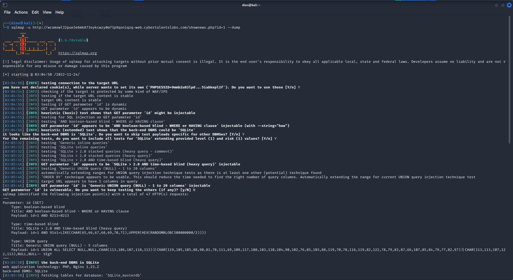
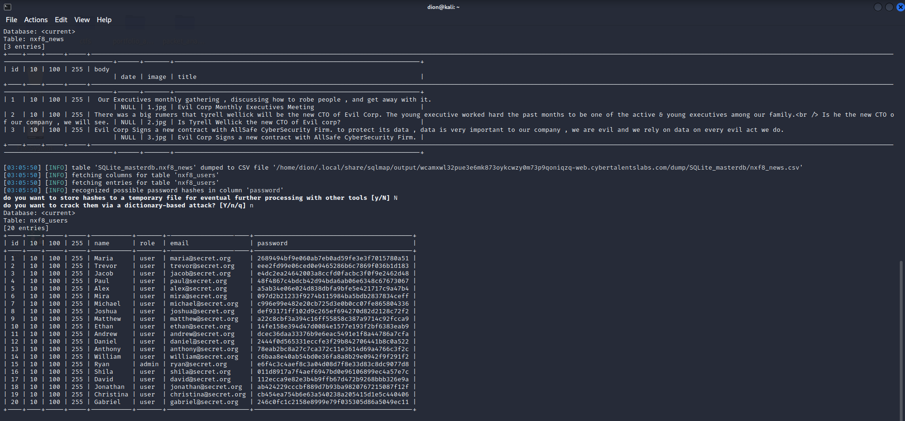

# who is admin

>“Your mission is to know who's the admin running this website by knowing his email.”

The landing page when I visit the CTF link contains three photos. Each has a title, a caption beneath the picture, and a link “Read More”.  I visit all three links and notice the URL pattern is `.../shownews.php?id=1`

One of the best way to retrieve hidden data from webapps is via SQL injection. [This link](https://portswigger.net/web-security/sql-injection) outlines a way to do this by putting `‘--` after the variable, in this instance `id`. 

>"...the double-dash sequence -- is a comment indicator in SQL, and means that the rest of the query is interpreted as a comment. This effectively removes the remainder of the query..."

I try this with my URL...
`.../shownews.php?id=1'--`

...and get an error:

`Error : HY000 1 unrecognized token: "'--"`

This doesn’t give me much info to work with but I want to keep exploring the possibility of using a SQL injection. I open up SQLMAP and run it at the default level 1 (out of 5). Below is the output, telling us that on a basic test the “id” parameter may be injectable and that the backend database management system is SQLite:

It finally spits out the following table of users, their respective ids, anmes, roles, emails, and hased passwords.

Out of all twenty users, one is an admin. I try `Ryan` as the flag, which it wasn’t. Typing the email `ryan@secret.org` I have more luck and get the flag.
